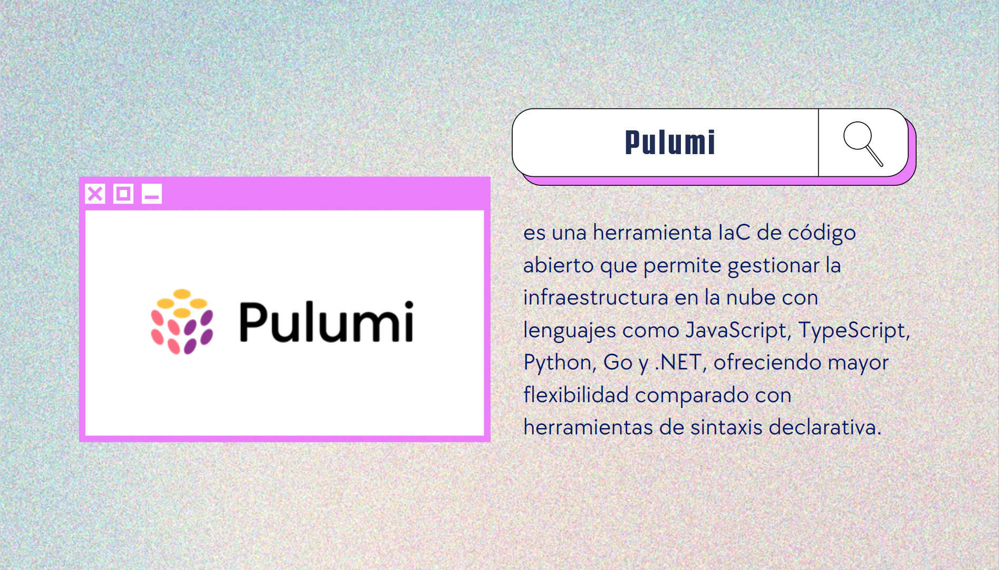
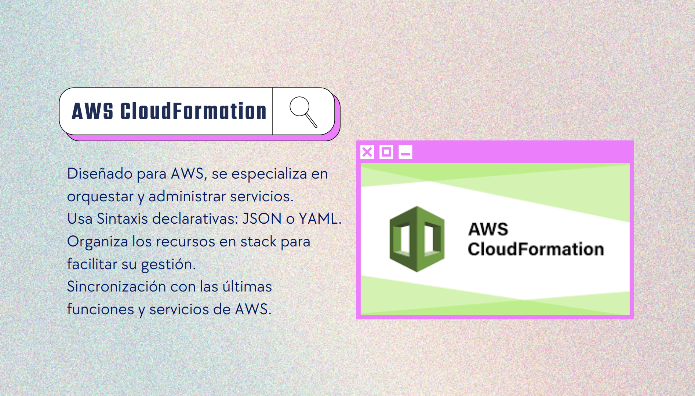
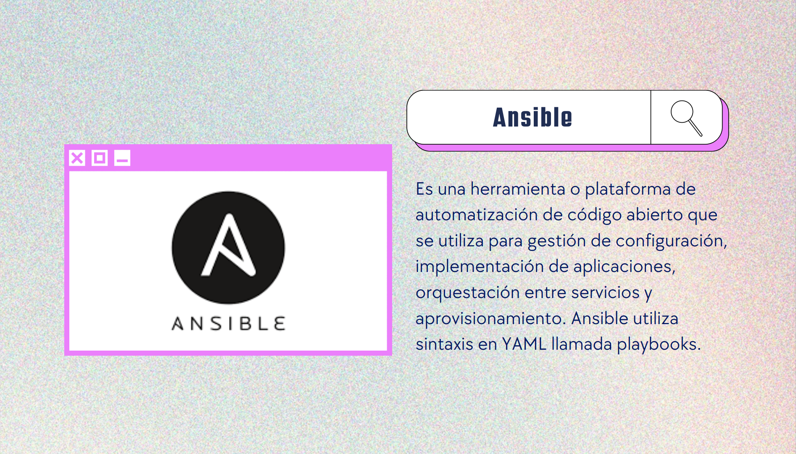
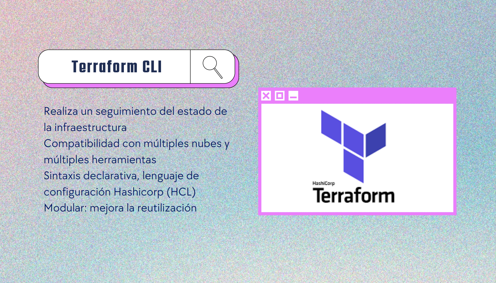
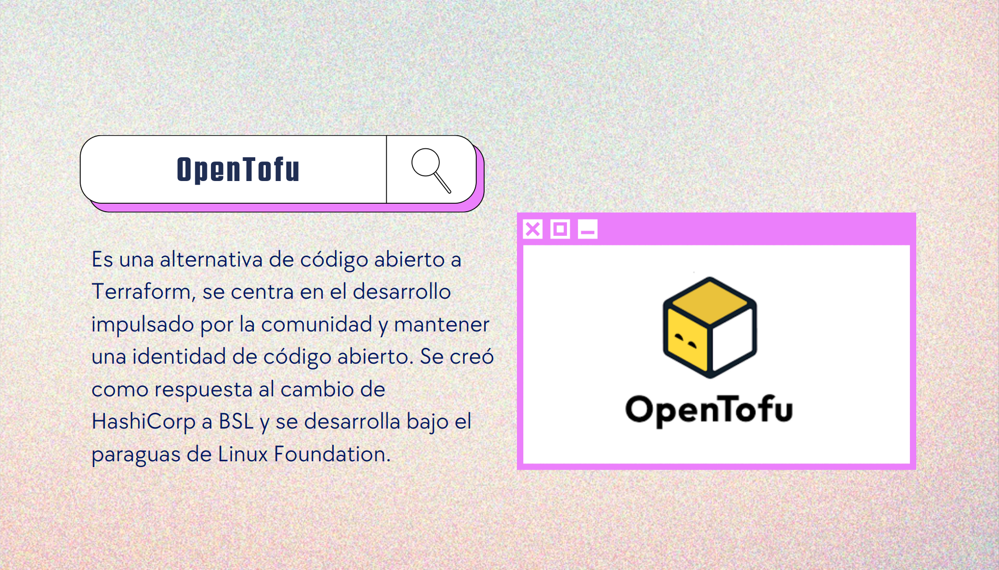

[comment]: # (Pass optional settings to reveal.js:)
[comment]: # (controls: true)
[comment]: # (keyboard: true)
[comment]: # (markdown: { smartypants: true })
[comment]: # (hash: false)
[comment]: # (respondToHashChanges: false)
[comment]: # (Other settings are documented at https://revealjs.com/config/)

Alma Gonzalez | Inno It | 19 Noviembre 2024

# `Terraform 101`

[comment]: # (!!! data-background-image="media/background/4.png" data-background-size="contain")

## Infraestructura como Código (IaC)

 > Se refiere a la gestión y aprovisionamiento de infraestructura a través de código en lugar de procesos manuales.

[comment]: # (!!! data-background-image="media/background/1.png" data-background-size="contain" data-auto-animate)

### Terraform para desarrolladoras: 

- Permite definir la infraestructura de manera declarativa, lo que hace más fácil entender el estado deseado.
- Antes de aplicar cambios, Terraform permite visualizar el impacto de los mismos con el comando `terraform plan`.
- Lleva un seguimiento del estado de la infraestructura, lo que ayuda a gestionar cambios y dependencias.

[comment]: # (!!! data-background-image="media/background/1.png" data-background-size="contain" data-auto-animate)
### IaC fuera de terraform:
 CloudFormation (AWS), Azure Resource Manager, Ansible, Pulumi.

[comment]: # (!!! data-background-image="media/background/1.png" data-background-size="contain" data-auto-animate)

 <!-- .element: style="transform: scale(1.25);" -->

[comment]: # (||| data-background-image="media/background/2.png" data-background-size="contain" data-auto-animate)

 <!-- .element: style="transform: scale(1.25);" -->

[comment]: # (||| data-background-image="media/background/2.png" data-background-size="contain" data-auto-animate)

<!-- .element: style="transform: scale(1.25);" -->

[comment]: # (||| data-background-image="media/background/2.png" data-background-size="contain" data-auto-animate)

 <!-- .element: style="transform: scale(1.25);" -->

[comment]: # (||| data-background-image="media/background/2.png" data-background-size="contain" data-auto-animate)

<!-- .element: style="transform: scale(1.25);" -->

[comment]: # (!!! data-background-image="media/background/2.png" data-background-size="contain" data-auto-animate)

## Instalar Terraform
[comment]: # (!!! data-background-image="media/background/titulo_m.png" data-background-size="contain" data-auto-animate)

- CLI de Terraform
  - El cliente es un único binario ejecutable compilado desde Go. Solo se necesita descarguar el binario apropiado para
  el sistema operativo y arquitectura desde el sitio web de Terraform.
    - https://developer.hashicorp.com/terraform/install
    
[comment]: # (!!! data-background-image="media/background/1.png" data-background-size="contain" data-auto-animate)
- TFenv
  - Terraform version manager
    - https://github.com/tfutils/tfenv?tab=readme-ov-file#installation

[comment]: # (!!! data-background-image="media/background/1.png" data-background-size="contain" data-auto-animate)

### Cómo funciona Terraform ?

[comment]: # (!!! data-background-image="media/background/titulo_l.png" data-background-size="contain" data-auto-animate)

Terraform crea y administra recursos en plataformas en la nube y otros servicios a través de sus interfaces de programación de aplicaciones (API).

Los proveedores permiten que Terraform funcione con prácticamente cualquier plataforma o servicio con una API accesible.

[comment]: # (!!! data-background-image="media/background/1.png" data-background-size="contain" data-auto-animate)

HashiCorp y la comunidad Terraform ya han escrito miles de proveedores para administrar muchos tipos diferentes de recursos y servicios.

Puede encontrar todos los proveedores disponibles públicamente en el Registro de Terraform:
Amazon Web Services (AWS), Azure, Google Cloud Platform (GCP), Kubernetes, Helm, GitHub, Splunk, DataDog ...


[comment]: # (!!! data-background-image="media/background/1.png" data-background-size="contain" data-auto-animate)

### Terraform Providers

[comment]: # (!!! data-background-image="media/background/titulo_m.png" data-background-size="contain" data-auto-animate)

Un `Terraform provider plugin` es un binario ejecutable que implementa el marco de complementos de Terraform.
Crea una capa de abstracción entre las API ascendentes del proveedor y las construcciones con las que Terraform espera trabajar.
https://registry.terraform.io/browse/providers

[comment]: # (!!! data-background-image="media/background/1.png" data-background-size="contain" data-auto-animate)

```HCL [1-9|11-13]
terraform {
  required_providers {
    aws = {
      source  = "hashicorp/aws"
      version = "~> 4.16"
    }
  }

  required_version = ">= 1.2.0"
}

provider "aws" {
  region  = "us-west-2"
}

```
[comment]: # (!!! data-background-image="media/background/1.png" data-background-size="contain" data-auto-animate)


### Recursos

[comment]: # (!!! data-background-image="media/background/titulo_m.png" data-background-size="contain" data-auto-animate)


Use "resourceblocks" para definir los componentes de su infraestructura. Un recurso puede ser un componente físico o virtual, como una instancia EC2, o puede ser un recurso lógico, como una aplicación Heroku.

"resourceblocks" tiene dos cadenas antes del bloque: el tipo de recurso y el nombre del recurso. En este ejemplo, el tipo de recurso es aws_instance y el nombre es app_server. El prefijo del tipo se asigna al nombre del proveedor. En la configuración de ejemplo, Terraform administra el recurso aws_instance con el proveedor aws. Juntos, el tipo de recurso y el nombre del recurso forman un ID único para el recurso. Por ejemplo, el ID para su instancia EC2 es aws_instance.app_server.

"resourceblocks" contiene argumentos que se utilizan para configurar el recurso. Los argumentos pueden incluir cosas como tamaños de máquinas, nombres de imágenes de disco o ID de VPC. Nuestra referencia de proveedores enumera los argumentos obligatorios y opcionales para cada recurso. Para su instancia EC2, la configuración de ejemplo establece el ID de AMI en una imagen de Ubuntu y el tipo de instancia en t2.micro, que califica para el nivel gratuito de AWS. También establece una etiqueta para darle un nombre a la instancia.

https://registry.terraform.io/providers/hashicorp/aws/latest/docs

[comment]: # (!!! data-background-image="media/background/1.png" data-background-size="contain" data-auto-animate)

Resource block

```HCL
resource "aws_s3_bucket" "example" {
  bucket = "my-tf-test-bucket"

  tags = {
    Name        = "My bucket"
    Environment = "Dev"
  }
}

```

[comment]: # (!!! data-background-image="media/background/1.png" data-background-size="contain" data-auto-animate)


fin

[comment]: # (!!! data-background-image="media/background/1.png" data-background-size="contain" data-auto-animate)

Notice the background color change.

[comment]: # (section attributes for the just-ending slide can be specified:)
[comment]: # (!!! data-background-color="aquamarine")

Use background videos, background pictures and **text formatting**,
everything *without breaking* your markdown files.

[comment]: # (Other background options: https://revealjs.com/backgrounds/)
[comment]: # (!!! data-background-video="media/video.mp4", data-background-video-loop data-background-video-muted data-background-opacity="0.2")

Even speaker notes, accessed through the `S` key on your keyboard.

(You may have to allow pop-up windows and try again.)

Note:
This will only appear in the speaker view! 🤯

[comment]: # (!!!)

## Pictures

 <!-- .element: style="height:50vh; max-width:80vw; image-rendering: crisp-edges;" -->

Showcase media including images, videos and animations.

[comment]: # (!!!)

## Animations

- This is an example list
- Just to showcase Reveal.js' animations

[comment]: # (!!! data-auto-animate)

## Animations

- This is an example list
- Just to showcase Reveal.js' animations
- This item will be automatically faded-in

[comment]: # (!!! data-auto-animate)

```js [1-2|3|4]
let a = 1;
let b = 2;
let c = x => 1 + 2 + x;
c(3);
```
<!-- .element: data-id="code" -->

[comment]: # (!!! data-auto-animate)

```js [5]
let a = 1;
let b = 2;
let c = x => 1 + 2 + x;
c(3);
c(5);
```
<!-- .element: data-id="code" -->

Animate code as well <!-- .element: class="fragment" data-fragment-index="1" -->

[comment]: # (!!! data-auto-animate)

Insert Youtube videos.

<iframe width="560" height="315" src="https://www.youtube.com/embed/KPfzRSBzNX4" frameborder="0" allow="accelerometer; autoplay; clipboard-write; encrypted-media; gyroscope; picture-in-picture" allowfullscreen></iframe>

[comment]: # (!!!)

Insert local videos.

<iframe width="560" height="315" src="media/video.mp4" frameborder="0" allow="accelerometer; autoplay; clipboard-write; encrypted-media; gyroscope; picture-in-picture" allowfullscreen></iframe>

[comment]: # (!!!)

Download [markdown-slides](https://gitlab.com/da_doomer/markdown-slides)!

[comment]: # (!!!)

A couple more examples follow.

[comment]: # (!!!)


***use markdown to write slides***

Author Name

[comment]: # (!!!)

Add tables:

| Insert | Tables |
| ------ | ------ |
| A row  | Another|
| text   | more   |

[comment]: # (!!!)

## Vertical separator

----------

Some other text.

[comment]: # (!!!)

You can also use in-line HTML.

<div style="font-size: 1em;">
small
</div>

<div style="font-size: 5em;">
large
</div>
